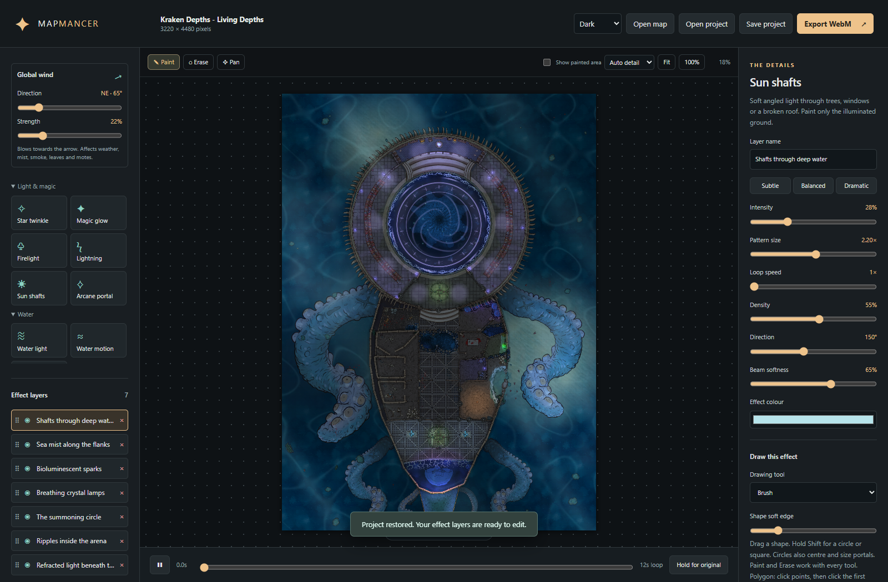
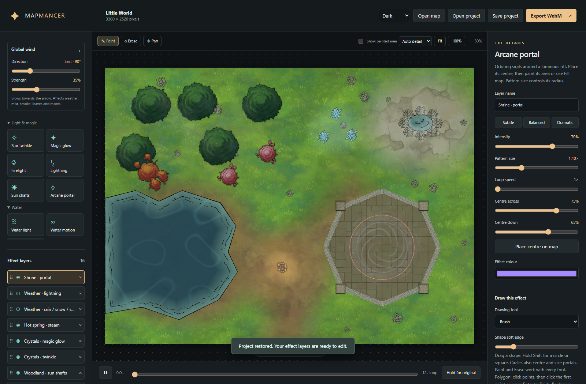
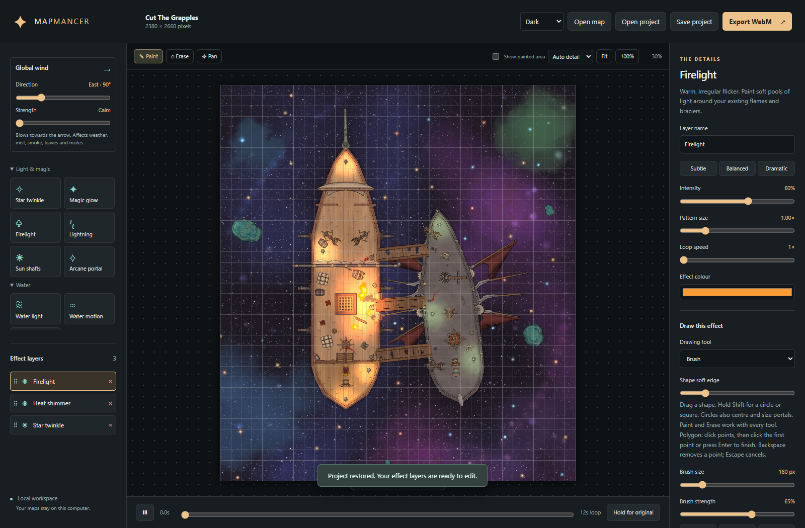

# Mapmancer

**Paint a little magic into your battlemaps.**

A free, open-source desktop-friendly editor for turning still maps into living scenes. Paint effects where they belong, shape the atmosphere, and export a seamless WebM at the map's original resolution.

[Download v1.0.0](https://github.com/Dangerousbros/Mapmancer/releases/latest) · [Quick start](#quick-start) · [Drawing tools](#drawing-tools) · [Contributing](CONTRIBUTING.md)



## What you can make

- **Water:** moving caustics, gentle refraction and expanding ripples.
- **Weather:** layered rain, snow, sandstorms, drifting mist and cloud shadows.
- **Life and light:** sakura petals, autumn leaves, embers, fireflies, sun shafts and flickering firelight.
- **Magic:** twinkling highlights, glowing crystals, lightning and arcane portals.
- **Atmosphere:** heat shimmer, smoke and steam.

16 effect families, 23 styles, shared wind direction and strength, and Subtle / Balanced / Dramatic presets. Every layer has its own editable mask and controls.

## Quick start

1. Download and extract **Mapmancer-1.0.0.zip** from [Releases](https://github.com/Dangerousbros/Mapmancer/releases/latest).
2. Install [Python 3.10 or newer](https://www.python.org/downloads/), with Python on PATH.
3. Install [FFmpeg](https://ffmpeg.org/download.html) with the `libvpx-vp9` encoder. Put `ffmpeg.exe` beside `server.py`, add FFmpeg to PATH, or set `MAP_FX_FFMPEG` to its executable.
4. On Windows, double-click **Start Mapmancer.vbs**. Edge or Chrome opens a dedicated app window without tabs or an address bar.
5. Choose an included example, or open a PNG, JPG or WebP. Add effects, draw their areas, and save your `.mapfx` project.
6. Export WebM, then enable looping in your virtual tabletop.

No account, subscription, cloud upload, or Python packages are required. The download is a **portable source package**, not a standalone executable: Python and FFmpeg are installed separately. FFmpeg is not bundled.

### Other launch options

```sh
python desktop.py             # Desktop app window; Edge/Chrome/Chromium when found
python server.py              # Default browser, localhost:8765
python server.py --no-open     # Server only
```

Desktop mode uses localhost:8767 and a separate browser profile. Close the app window to stop its server. Launch one desktop instance at a time. If no supported Chromium browser is found, the launcher falls back to your default browser; keep the launcher running. Browser mode also works on macOS and Linux with Python, FFmpeg and a WebGL 2 browser. Windows is the tested desktop platform.

## Drawing tools

| Tool | Use |
| --- | --- |
| Brush | Paint soft, organic masks with adjustable size and strength. |
| Circle / ellipse | Drag to draw; hold Shift for a circle. Also centres and sizes a portal. |
| Square / rectangle | Drag to draw; hold Shift for a square. |
| Polygon | Click points, then click the first point or press Enter to close. Backspace removes the last point; Escape cancels. Concave outlines are supported. |

Paint and Erase work with every tool. Polygons have crisp edges for accurate reveals; ellipses and rectangles offer inward feathering. Undo restores an entire drawing operation. Masks remain editable after saving and reopening.

**Shortcuts:** B Paint · E Erase · H Pan · Space + drag Pan · Ctrl+Z Undo · Scroll Zoom.

## Built for actual tabletop maps

- **Original resolution:** exports retain exact pixel width and height. A 140-pixel Dungeondraft square remains 140 pixels.
- **Seamless loops:** 12 seconds at 20 fps by default, with high-quality VP9 WebM encoding.
- **Editable projects:** `.mapfx` includes the original image, masks, layer order, wind and effect settings.
- **Live preview:** automatic detail as you zoom, full-resolution inspection, and a fast mode for slower computers.
- **Layer control:** reorder by dragging, hide, delete, duplicate and compare with the original.
- **Light / Dark / System:** choose a theme without changing your map's colours.

Preview rendering and masks use separate working resolutions; export always renders at source resolution. Heat shimmer and water motion deliberately distort pixels inside their masks. Large maps and many active layers need more GPU memory and take longer to export. The editor supports up to 16 layers and 100 megapixels, subject to your GPU's limits.

## Three ready-to-edit examples

| Example | Explore |
| --- | --- |
| **Little World** | Woodland, pond, campfire, crystals and a portal shrine. |
| **Kraken Depths — Living Depths** | Underwater light, magical ambience and a luminous portal. |
| **Cut the Grapples** | Twinkling stars, heat shimmer and firelight aboard a ship. |





Select an example on the welcome screen or open its `.mapfx` from `Examples/`. These are flattened map images with editable animation layers, not redistributable Dungeondraft asset packs. See [artwork credits and terms](Examples/ARTWORK.md).

## Development

Vanilla JavaScript, WebGL 2 and a Python standard-library loopback server. No frontend build step.

```sh
python -m py_compile server.py desktop.py
node --check web/app.js
npm install
npm test
```

Start `python server.py --no-open --port 8766` before browser tests. Tests use Chrome by default; see [CONTRIBUTING.md](CONTRIBUTING.md) for configuration.

## Licence

Application source: [MIT](LICENSE). Free to use, modify and redistribute, including commercially. Bundled map artwork and screenshots are excluded from the MIT licence; the underlying artwork remains with its respective creators. Mapmancer is an independent project, not affiliated with Dungeondraft, Crosshead Studios or Roll20.

## Disclaimer

This software was created with the assistance of generative AI.
